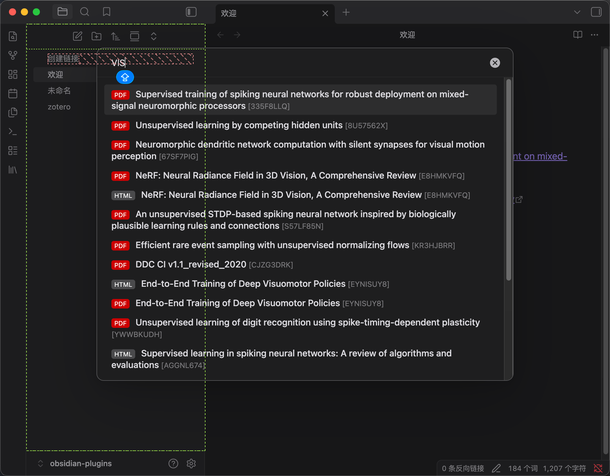
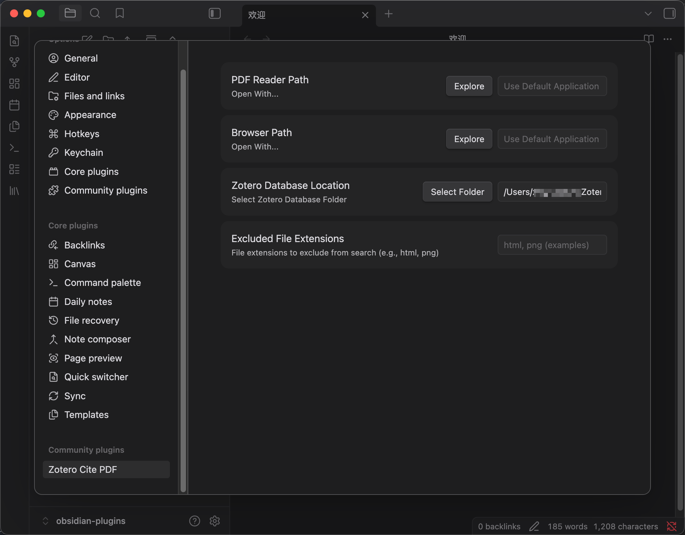

# Zotero Cite PDF Plugin

Cite zotero pdf/html/others and directly open it in obsidian.

## Prepare

1. Go to Settings
2. Set Zotero database folder (Zotero data directory).

## Search Literature of Zotero

1. Click search button || Use command: Search Zotero Literature
2. Input keywords
3. Click item and insert it into obsidian

## Directly Open Assets of Zotero

> You can open PDF/HTML link by custom app

https://github.com/user-attachments/assets/0b0b782c-0fc1-45e4-bdfd-29be2252c817

## Settings

